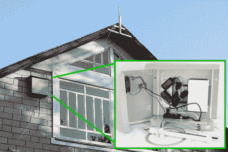

# 3G 连接热点挂在你的房子里

> 原文：<https://hackaday.com/2011/10/31/3g-connected-hotspot-hangs-out-at-your-house/>

[Drug123]充分利用了他父亲家山墙尽头的这个不起眼的灰色盒子。它[提供一个 3G 互联网连接](http://make-a-project.blogspot.com/2011/10/diy-outdoor-all-weather-3gwi-fi-router.html),否则是不可用的..

他父亲居住的社区没有有线或光纤宽带，这激发了他的项目想法。他知道一些邻居正在使用 3G 连接，但他无法让它在房子里工作。因此，他着手开发一种既能与蜂窝网络通信，又能提供 WiFi 连接的外部设备。用于此的硬件相对昂贵；一个 USB 3G 调制解调器和一个带 USB 端口的 WiFi 路由器。

盒子本身是由塑料制成的，但即使没有使用金属外壳形成的法拉第笼效应，3G 调制解调器的内置天线也无法完成这项工作。你可以看到[drug 123]的解决方案是一个安装在车顶的外置天线。盒子里有一个排气扇，当它们太热时可以降温，还有一些功率电阻，在最冷的夜晚提供热源。低成本的建造当然符合要求，而且也不会对眼睛造成太大伤害。