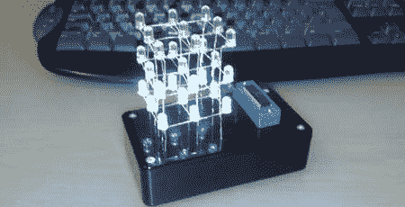

# 3x3x3 LED 立方体

> 原文：<https://hackaday.com/2008/06/20/3x3x3-led-cube/>

【portreathbeach】搭建了这个[简单的 3x3x3 LED 矩阵](http://www.instructables.com/id/3x3x3-LED-Cube/)。它使用 PIC16F690 作为大脑的 ZIF 插座。每层有九个阴极连在一起的发光二极管。每个 LED 的阳极连接到下面的 LED。led 是多路复用的，因此即使所有层看起来都是开着的，它们也是单独寻址的。他包括软件，所以你可以建立自己的动画。休息之后是黑客帝国的视频。

[https://www.youtube.com/embed/B8wd8xNDPFU?version=3&rel=0&showsearch=0&showinfo=1&iv_load_policy=1&fs=1&hl=en-US&autohide=2&wmode=transparent](https://www.youtube.com/embed/B8wd8xNDPFU?version=3&rel=0&showsearch=0&showinfo=1&iv_load_policy=1&fs=1&hl=en-US&autohide=2&wmode=transparent)

*   [永久链接](http://www.instructables.com/id/3x3x3-LED-Cube/)