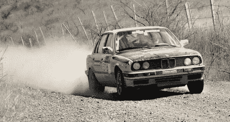

# 500 美元的 Craigslist 汽车与 40 万美元的赛车竞争…

> 原文：<https://hackaday.com/2010/03/25/500-craigslist-car-competes-against-400000-race-car/>

…并且赢了。嗯，排名第三，但对于这样一个[便宜的参赛选手](http://jalopnik.com/5497042/how-a-500-craigslist-car-beat-400k-rally-racers)来说，还是令人惊讶的好。这是一场真正的表演，只要有足够的精力和[大灯液体](http://www.youtube.com/watch?v=9HZnIoFAGps#t=1m50s)任何事情都可以完成金钱只是让事情变得容易得多。

从防滚架到 5 分钟的油箱修理，一切都是由[比尔·卡斯维尔]编造的。嗯——在这一点上，杜撰是管道胶带的一个粗略术语，但对于任何黑客和汽车爱好者来说，这仍然是一个令人敬畏和真正激励人心的故事。

[感谢 TJ 沃克]