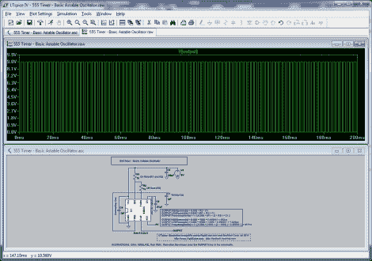

# 555 定时器电路仿真软件

> 原文：<https://hackaday.com/2011/02/08/555-timer-circuit-simulation-software/>

[FightCube]在推荐一款[非常有帮助的电路仿真软件](http://badwolf.hackhut.com/2011/02/08/simulate-your-555-timer-circuits-with-ease/)中写道，这是给那些还在为 [555 设计大赛](http://555contest.com/)制作参赛作品的人的。Linear Technology 提供的 LTSpiceIV 允许您构建中等复杂程度的 555 驱动电路，包括电容、电阻、二极管、fet 等常见元件。一旦构建好电路，您就可以在一个易于使用的可视化窗口中查看结果，而无需触摸烙铁或试验板。根据[FightCube]的说法，该软件相当容易使用，最棒的是，它是免费的。

他分享了一个他构建的基本电路，作为该软件功能的演示，并承诺分享更多，以激励其他人参加竞赛。