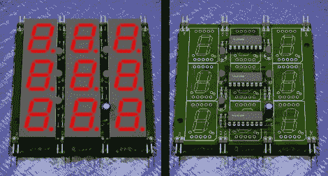

# 七段数独

> 原文：<https://hackaday.com/2010/08/19/7-segment-sudoku/>

[John Sarik]不断为他的数字数独项目提出新的想法。[这次他用七段显示器](http://trashbearlabs.wordpress.com/2010/07/30/geekdad-design-competition-7-segdoku/)显示每个数字。游戏玩法和[的数码管版本](http://hackaday.com/2010/07/19/nixie-sudoku-a-look-at-the-hardware/)一样，但是这让事情变得更容易建造。上面的棋盘是组成游戏的九个模块之一。它们各自使用三个移位寄存器来驱动九个 7 段显示器。在五个电阻的帮助下，所有多路复用都通过这些芯片上的串行输入来寻址。