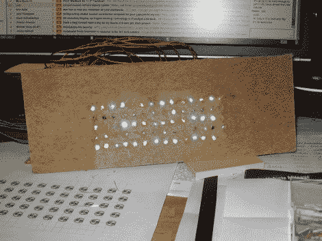

# 南瓜灯中的 70 个 LED 矩阵

> 原文：<https://hackaday.com/2010/10/26/70-led-matrix-in-a-jack-o-lantern/>

什么东西需要八个小时来焊接，并且使用了你认为可以想象的更多的收缩管？一个 LED 矩阵安装在一个真正的南瓜里。当我在上周五的帖子中提到我们希望[将 led 南瓜扩大到全 LED 矩阵时，我不知道会是我来做这项工作。但是[Caleb]和我认为这可能是黑客最喜欢的节日礼物。](http://hackaday.com/2010/10/22/halloween-props-pumpkin-in-standby-mode/)

安装在秋菜中的是一个由 5×14 发光二极管矩阵制成的帐篷。我在电脑上打印出一个网格，贴在南瓜上，在南瓜的前面钻了 70 个孔，从而隔开了它们。真正的麻烦来自于从内部插入所有的发光二极管；每一个都焊接了四根电线，形成了一个黑色的电线网。上面你可以看到它变得很棒。这是它滚动信息万圣节快乐的一个镜头。

休息后加入我们，观看这个道具的视频。但我们不只是分享成品。我将带您完成构建过程。在此过程中，您将了解 LED 矩阵的设计考虑因素，以及如何使用这些技术来构建自己想要的任何尺寸和配置。

如果你想看横幅图片[的更大版本，试试这个](http://hackaday.com/wp-content/uploads/2010/10/70-led-in-a-pumpkin1.jpg)，下面是承诺的视频剪辑。很抱歉质量差，我正在努力借一个更好的录像机(如果我设法得到一个，我会发布更新)。有几个动画对摄像机来说发生得太快了。一个是看起来像赛昂人的眼睛或《霹雳游侠》中的车凯特的正面的左右扫描。视频中表现不佳的另一个效果是描绘显示器矩形轮廓的追逐功能。这两个看起来都很棒，幸运的是滚动文本在视频中表现得很好。

[https://www.youtube.com/embed/ZxhLMC6zip4?version=3&rel=1&showsearch=0&showinfo=1&iv_load_policy=1&fs=1&hl=en-US&autohide=2&wmode=transparent](https://www.youtube.com/embed/ZxhLMC6zip4?version=3&rel=1&showsearch=0&showinfo=1&iv_load_policy=1&fs=1&hl=en-US&autohide=2&wmode=transparent)

我将带你进入 LED 矩阵设计的兔子洞，但在此之前，让我们看看制作这个南瓜灯需要什么。如果你觉得力不从心，我们有一个初学者教程来帮助你开始使用这些微控制器。

## **构建硬件**

在讨论如何设计电路之前，我们先来看看构建过程。


我从一开始就决定使用不同颜色的发光二极管。出于我将在本教程的设计部分深入讨论的原因，我需要以大约 10 mA 的电流驱动每个 led。我计算我的电阻，然后测量每一个，以确保我接近我的目标。这正好适合蓝色。


我想要一种在焊接时固定 led 的方法，我还需要一个在南瓜上钻孔的模板。在这里，我使用我的鹰板布局制作的模板，用一些硬纸板制作一个装配夹具。这被证明是一个相当糟糕的材料选择，因为它开始在底部分开，但它工作了。


我需要将同一行的所有阴极焊接在一起。我剪下小段电线(每行 13 根)加上一根较长的电线连接到驱动板。上图中，我正在将这些电线焊接成菊花链。


这是一排菊花链…还有四排。


我用的是透明的发光二极管，这意味着当没有电的时候，你看不出它们是什么颜色。在将一行移动到装配夹具之前，我在试验板上测试了它们。


当我把每个 LED 从试验板上移到夹具上时，我剪掉了多余的阴极引线。从那时起，记住这句口头禅:“首先是收缩管！”！!'否则你会后悔的。你可以在这张图片中的焊点上方看到它。


继续往下排，直到完成。在上面的图片中，我已经用打火机加热了收缩管。注意:上面两幅图像是不同的行。一个我从左边开始，另一个我从右边开始。希望不会太混乱。


这是一排完成的焊接。每次吃完后，我都把它拿出来放在一边。


所有的行已经完成，我已经重新安装在夹具中，准备将阳极焊接成列。


这是切断的电线，用来做柱子的菊花链。我用黑色的电线做短的部分，因为相比红色的电线，我有大量的黑色电线，红色的电线是我用来做控制线的。


完整的列菊花链。

[](http://hackaday.com/wp-content/uploads/2010/10/pumpkin-soldering-columns.jpg)

在这里，我焊接第四列。当我完成一个后，我就举起五个 led 灯，用第三只手把它们放在一边。慢慢来，耐心点…你能行的！


搞定了。嗯，发光二极管都是焊接的。是时候为这些行制作控制板了。


这是我的控制面板。我用热胶将从各行引入的线路粘到板上，以消除应力。每个都连接到 2N3904 晶体管的集电极。相机闪光灯使它很难看到，但有一个 3k3 的电阻连接到每个晶体管的基极。稍后我会给它们添加单导线，以便它们可以插入试验板。在左边你可以看到一条 GND 轨道的电线，它连接到电源的地面。

[](http://hackaday.com/wp-content/uploads/2010/10/pumpkin-column-headers.jpg)

每列包含相同颜色的 LED。我发现红色发光二极管需要一个不同于其他的电阻。在这里，我将电阻焊接到每列的控制线，并将组焊接到与试验板的每个接口的引脚头。


这是完成的控制板。试验板的中心是 ATmega168 微控制器。黑色拱形通过 3k3 电阻将晶体管基极连接到芯片的 PortC。有三组插入 PortB 和 PortD 的列引脚接头。


这是完整硬件的概述。在这一点上，我非常希望我能把这个放进南瓜里。



在这里，我在为矩阵的固件工作。这是一个更好的装配夹具材料的选择会很好。但就像我之前说的，这很有效。

## 把它放进南瓜里


我从一个相当大的捐赠南瓜开始。我试着挑一个脸比较平没有太多曲线的。


在开始之前，我确保通过在另一份我用于装配夹具的模板上贴胶带来确定矩阵的钻孔位置。


我在后面开了一个大入口，清理了内脏。从前面看不到它的接缝。


在这里，又好又干净。我想让尽可能多的湿糊糊的东西远离电子产品。


该钻孔了。我用竹制串肉扦在南瓜皮上戳了一个小孔，这样钻头就不会移动了。我发现一个 13/64 的钻头非常好用。


这是完成的网格。


这里是发光二极管需要去的地方。我花了一点时间，以确保洞被清理使用串。


深呼吸，开始插入发光二极管。一旦我把它们都放好了，我就给设备加电，并检查以确保我没有调换它们中的任何一个。一旦我知道这是正确的，我用一个串推动每一个 LED 通过表面。


这个小塑料盘保持底部的控制电路干燥。我为另一个项目添加了一个小小的 5v 稳压器，在较大的电路板下隐藏了一个 9V 的电池。


电源接通了，我用几根扦子封住了舱门。


这是开灯后的样子。这里展示的是作品 BOO。

[](http://hackaday.com/wp-content/uploads/2010/10/70-led-in-a-pumpkin1.jpg)

成品。呼，真是松了一口气！

如何设计 LED 矩阵

好了，让我们进入构建 LED 矩阵的原因和方法。

**复用**

我制作的显示器有 70 个发光二极管。如果您单独寻址每个 LED，您的微控制器上需要 70 个引脚。但是有一个更简单的方法。[多路复用](http://en.wikipedia.org/wiki/Multiplexed_display)是一种一次只点亮显示屏一部分的方法。使用微处理器，你可以如此快速地切换哪个部分打开，以至于你的眼睛永远感觉不到它关闭了。

因为在扫描显示器的其他部分时，一个部分将被关闭，所以您希望保持复用部分的数量较低。我选择复用这个矩阵的五行。这意味着一行将占 1/5 的时间，我们称之为 1/5 占空比。这基本上是一种脉宽调制，一种我们用来调暗 led 的技术。正是因为这个原因，我使用了超亮的发光二极管。

这里是这个显示器的多路复用是如何工作的:关闭所有的行和列。在第一行中设置要照亮的列。打开第一个行驱动器，该行中的列将亮起。重新开始，移到第二排。这是我建立的矩阵的示意图(点击放大):

[](http://hackaday.com/wp-content/uploads/2010/10/pumkin-matrix.png)

**列和寻址**

我们希望每个 LED 都有相同的亮度。因为一次只能有一行打开。每列中的单个电阻器将为该列中的所有 led 工作。这是因为为了让电流流动，LED 必须同时连接到电压和地。所有的阳极(LED 的正极引线)按列连接在一起，所有的阴极(LED 的负极引线)按行连接。因此打开列 1 和行 1 将让电流流过该位置的 LED。行 0、2、3 和 4 中的 led 将不会发光，因为它们的行还没有打开，所以它们的阴极没有接地。通过这种方式，我们构建了一个可寻址的 led 网格。

**尺寸限制**

多路复用引入了电流消耗的问题。我可以驱动的列数有限，因为我将它们连接到一个微控制器。如果您查看数据手册中的 ATmega168 电气特性，您会发现它可以为每个引脚提供 40mA 电流。但是，该芯片(VCC)的电源引脚能够提供的电源是有限制的。VCC 引脚限于 200 毫安。我们必须保持在阈值以下，否则芯片可能会损坏。

这是我选择使用 14 列的部分原因。永远不会有超过 14 个发光二极管同时打开，因为这就是一行中的数量。如果我以 10mA 的电流驱动它们，则总电流为 140mA。这低于 200mA 阈值，为误差和 ATmega168 运行所需的电流留出了一些空间。我还将其限制为 14 个，因为我想在设备上保留 2 个特定的引脚用于其他目的，但稍后会有更多。

我们需要考虑 LED 矩阵低端的电流。这些行充当显示器的接地连接。如果一行中的所有 led 同时点亮，大约会有 140mA 的电流通过控制线。它不能直接连接到微控制器，因为一个引脚的电流太大。相反，我用了一个 NPN 晶体管。2N3904 方便地具有 200mA 限值，足以处理显示器的 140 mA 吸电流。这些晶体管像开关一样工作，只需要你切换的电流的 1/100 出现在器件的基极引线上，以便它将控制线连接到地。

我们如何制作更大的显示屏？

我想让这个显示器的部件数量少一些，但如果你愿意添加更多的组件，大小真的没有限制。更强大的晶体管允许你切换更高的电流。您可以使用级联移位寄存器来扩展列数。这些移位寄存器是通过一条数据线和一个时钟寻址的……以串行方式发送数据，而不是像本例中那样以并行方式发送。因为每列需要两个周期(一个周期用于设置数据位，一个周期用于记录数据位，并重复直到所有列都被脉冲输入)，所以速度受到影响。详细解释这一点超出了本教程的范围，但只要你将器件的电流消耗保持在器件规格范围内，你就可以*变大。*

**建立连接**

正如我上面所说，我想保持我的零件数量最少，所以选择不使用移位寄存器。这意味着我需要每列一个引脚，每行一个引脚。使用微控制器的 PortB 和 PortD 上的所有八个引脚，我仍然可以将五行连接到 PortC，并且至少留下一个引脚(如果您想使用 RST 作为 I/O，则留下两个引脚)。为什么我没有把这个做成 16 列长呢？

有一个很好的理由。我想把芯片上的串行端口留给将来使用。RXD 和 TXD 位于 PortD 的引脚 0 和 1 上。我可以将最后两列移动到不同的端口，但这将意味着为这两列寻址 3 个端口，而不是两个；导致处理器的性能下降。

## 编写代码

为多路显示编写代码分为两部分:某种类型的帧缓冲区，以及在后台处理多路复用的代码。**请[下载源码包](https://github.com/Hack-a-Day/had_pumpkin)并跟随。**顶部有引脚、端口和数据方向寄存器定义，这将阐明本文中的一些代码示例在做什么。

**帧缓冲**

这是一个简单的概念。您需要一个表示物理显示的数据结构。我们操作的像素不是开就是关，这就是二进制代码的定义。所以我们只需要把当前显示的帧想象成五个整数。使用 AVR 时，整数是 16 位数字；每个 LED 一个位(两个位将被浪费),五行五个整数:

```
volatile int buffer[5] = { 0x0000, 0x0000, 0x0000, 0x0000, 0x0000 };
```

我用十六进制代替二进制来实例化这个数组。这是一种非常常见的做法，因为它需要 1/4 的字符来表示相同数量的数据。请放心，0x0000 和 0b00000000000000 等于相同的值。

还要注意，我使用了关键字“volatile”。这一点非常重要，因为中断服务程序和代码主体都会访问这些数据。如果它不是易失性的，编译器可能会优化掉对该代码的更改，从而导致奇怪且难以调试的行为。此外，我们在 8 位设备上使用 16 位数据类型。更改数据时禁用中断很重要，这样我们就不会在更改整数的第一个和第二个字节之间发生中断。稍后将详细介绍。

**中断驱动复用**

这确实是这个过程中最容易的部分之一。一开始很难想象会发生什么。

我们不想去想扫描我们的五行会发生什么。使用一个基于定时器的中断，我们可以以恒定的速率多路复用显示，然后忘记它。

它是这样工作的。我们设置了一个定时器，每秒触发多次中断。当中断发生时，处理器将停止运行我们代码的主循环(不管发生了什么)，并运行我们的中断服务程序(ISR)中的代码。下面是我如何设置定时器 1 每秒中断 500 次:

```
//Initialize the Timers
static inline void initTimers(void) //Function used once to set up the timer
{
  TCCR1B |= 1&lt;
  TIMSK1 |= 1&lt;
  OCR1A = 0x07D0;			//Set compare value for 500 times per second
sei();				//Enable global interrupts
}
```

让我们稍微考虑一下数学。ATmega168 有一个设置为 1 MHz 的内部时钟。我想让我的显示每秒钟更新 500 次，从而每秒钟完全刷新 100 次。因此，每秒 1，000，000 个周期除以 500 个中断等于 2000 个周期的目标。我需要设置一个计时器来计算每个系统时钟周期，当超过 2000 个周期时触发一个中断。这就是我对 OCR1A 值所做的，0x07D0 是 2000 的十六进制等效值。

对于那些真正知道自己在做什么的人来说，你可能已经注意到了一个错误。计时器从 0 开始计数，而不是从 1 开始计数，这意味着我真的应该在少于 0x07D0 的一个周期中断，但对于 jazz 来说已经足够接近了。

**中断处理**

既然我们已经编写了每秒钟产生 500 次中断的代码，那么当这种情况发生时，我们必须做些什么。计划是跟踪应该开启的下一行。在中断开始时，我们将关闭整个显示器，使用帧缓冲器设置要显示的下一行的列引脚，打开该行，并设置下一个中断。下面是实现这一点的代码:

```
ISR(TIMER1_COMPA_vect)	//Interrupt Service Routine handles multiplexing
{
  //Shutdown all rows
  rowPort &amp;= ~rowMask;

  //Shutdown all columns
  colPort0 &amp;= ~colMask0;
  colPort1 &amp;= ~colMask1;

  //Set buffer data to columns
  colPort0 = (char)buffer[row_track];
  colPort1 |= ((char)(buffer[row_track] &gt;&gt; 6) &amp; 0xFC); //Shift data and mask out lower bits (reserver for Rx and Tx)

  //Drive row
  rowPort |= (1&lt;&lt;(4-row_track));

  //Preload row for next interrupt
  if(++row_track == 5) row_track = 0;		//Row tracking
}
```

上面有一些神奇的代码。这里是断章取义，所以我们可以把它拆开:

```
colPort1 |= ((char)(buffer[row_track] &gt;&gt; 6) &amp; 0xFC)
```

我已经在前面的源代码中将‘col port 1’定义为 PORTD。我们保留了最低的两位，供以后作为串行连接使用。当我们将整数数据写入端口时，微控制器只会读取最低的 8 位，因为这是端口的大小。在等号的右边，我将整数数据转换为 8 位字符。我们需要第 8-13 列的整数数据的最高有效字节，所以我们将数据向右移动。但我只移动了 6 个空格，因为我们不会用到寄存器的低位两位。最后，我使用了按位的' & '操作符来屏蔽掉较低的两位，这样我们就不会混淆这些引脚将来可能出现的任何其他用途。我觉得这行代码是二进制数据强大力量的一个很好的例子，如果你不能完全理解它，你必须花时间去研究它是如何工作的。这是使用嵌入式系统的奇妙之处。

**操纵帧缓冲器**

我们的显示器在背景中是多路复用的，我们不再需要担心这一点。现在你可以通过操作帧缓冲区来显示任何你想要的东西。

在这种情况下，帧缓冲区是一个由五个整数值组成的数组。正如我前面所讨论的，当使用 8 位设备时，它至少需要 2 个周期来写入一个 16 位整数。如果在这两个周期之间触发中断会发生什么？因此，在改变帧缓冲器时禁用中断是很重要的。但是禁用中断会停止我们的自动多路复用，所以请确保您快速更改帧缓冲区并尽快启用中断。

```
void clearScreen(void)
{
  cli();
  for (unsigned char i=0; i&lt;5; i++) buffer[i] = 0x0000;
  sei();
}
```

上面的代码可能是我们可以使用的最简单的例子。这将立即清除显示。“CLI()；”命令将禁用中断，而' sei()'命令将启用它们。在这之间，我使用了一个“for”循环将缓冲区数组中的所有五个整数设置为 0x0000，这表示 off。如果我将它们设置为 0x1111，显示器中的所有 led 都会亮起。

**从这里开始**

解释示例代码的每一部分超出了本教程的范围。但是花些时间弄清楚它是如何工作的。我已经将字体数组和消息存储在 PROGMEM 中，否则我会耗尽 ram。[ [迪安相机](http://www.fourwalledcubicle.com/AboutMe.php)有[一个关于 PROGMEM](http://www.avrfreaks.net/index.php?name=PNphpBB2&file=viewtopic&t=38003) 使用的很棒的教程，如果你以前没有用过的话，你应该读一下。至于其他的，随便玩玩，看看你能做什么！

## 跟我来

## 资源

[源文件](https://github.com/szczys/had_pumpkin)

[如何对 AVR 微控制器进行编程](http://hackaday.com/2010/10/23/avr-programming-introduction/)