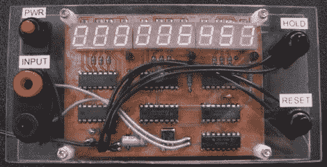

# 9 位脉冲计数器

> 原文：<https://hackaday.com/2010/04/30/9-digit-pulse-counter/>

这个 [9 位脉冲计数器](http://www.imsolidstate.com/archives/665)造价大约 20 美元，是自制工具的一个很好的例子。建造者[Josh]发现自己正在修理一个设备，需要一个脉冲计数器。有了便宜的部件，他就自己造了一个。他说，它有一些限制，比如显示亮度，但总体来说，它似乎做得很好。你可以从他的网站下载 PCB。

[via [MakeZine](http://blog.makezine.com/archive/2010/04/building_a_pulse_counter_on_the_che.html)