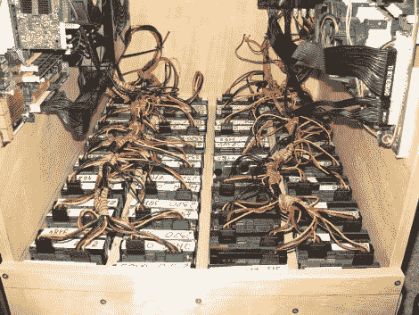

# 满足家庭存储需求的 90 TB 驱动器阵列

> 原文：<https://hackaday.com/2010/10/21/90-tb-drive-array-for-home-storage-needs/>

当你家里有一个 90tb 的硬盘阵列时，为什么要把它存储在云中呢？这些驱动器大多是 Western Digital Caviar Green EARS 2TB 型号，以节能和安静运行著称。不太清楚这是使用一个还是两个主板，但驱动器是使用 PCI RAID5 和 RAID5+0 控制卡连接的。机箱中共有 40 个散热风扇，一半在底部，另一半在顶部。他们将空气向上输送通过机箱，并计划在未来增加一个灰尘过滤器。见鬼，这种类型的空气流动，你可以扔在一个标准的炉过滤器。显然，它足够安静，可以在胶合板旁边“近乎耳语”地交谈。但是我们对这种说法有点怀疑。

它看起来不像去年的 67 TB 存储那么漂亮，但看起来确实很容易在家里构建。

[感谢恩里克通过[英语俄罗斯](http://englishrussia.com/index.php/2010/10/20/home-data-storage-for-70-tb/)