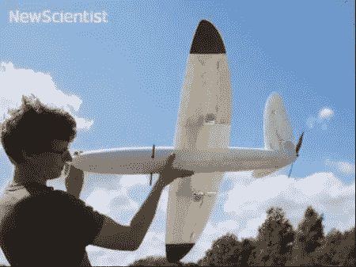

# 3D 打印的空中无人机

> 原文：<https://hackaday.com/2011/08/03/a-3d-printed-aerial-drone/>

无人机有许多形状和尺寸，但现在它们也可以被 3d 打印出来！为了制造这些无人机，[【解码】](http://www.soton.ac.uk/~decode/index.htm)小组使用了选择性激光[烧结](http://en.wikipedia.org/wiki/Selective_laser_sintering)工艺，这本身就很有趣。一旦打印过程完成，这些小飞机只需要五个结构和空气动力组件就能制造出来。因为它们的简单，据报道，这些无人机可以在不使用任何工具的情况下在十分钟内组装好并准备好飞行！

这个设计是由英国南安普顿大学的【工程和物理科学研究委员会】的一群学生完成的。除了这架特殊的飞机，他们还集中精力制造 20 公斤以下的自主无人机。使用这种设计的 3D 烧结工艺使他们能够按照自己的想法制造飞机，而不用考虑零件加工的难易程度。

这个小组在他们的网站上有几个关于他们的飞机的视频可以下载，但是休息后请查看关于他们项目的[【新科学家】](http://www.newscientist.com/article/mg21128235.700-3d-printing-the-worlds-first-printed-plane.html)片段的嵌入视频。

[https://www.youtube.com/embed/aFFFiB_if18?version=3&rel=1&showsearch=0&showinfo=1&iv_load_policy=1&fs=1&hl=en-US&autohide=2&wmode=transparent](https://www.youtube.com/embed/aFFFiB_if18?version=3&rel=1&showsearch=0&showinfo=1&iv_load_policy=1&fs=1&hl=en-US&autohide=2&wmode=transparent)