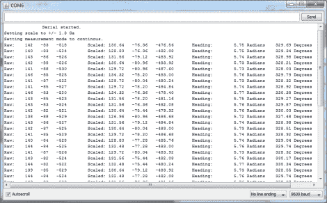

# 磁力计初学者指南

> 原文：<https://hackaday.com/2011/07/14/a-beginners-guide-to-magnetometers/>

LoveElectronics 的人最近发表了一篇文章，为那些有兴趣试用磁力计但可能不知道如何使用它们的人解释了磁力计的一些来龙去脉。

本文很大一部分专门讨论如何操作霍尼韦尔的 HMC5883L 磁力计，但许多信息也适用于其他品牌的指南针传感器。他们从最基本的术语开始讨论指南针是如何工作的，然后通过他们出售的分线板，深入研究如何将芯片与 Arduino 接口的一些细节。分线板实际上非常简单，因此可以为您自己的测试目的构建任意数量的定制迭代。

他们演示了他们制作的特定于 HMC5883L 的 Arduino 草图的使用，使初学者可以轻松地从指南针单元获得有用的数据。虽然预先制作的草图可能看起来有点逃避，但它至少给了好奇/积极的初学者一个机会来查看一些完整的代码，以便了解事情是如何工作的。

如果你对一些[额外的初学者概念](http://hackaday.com/2011/07/05/electronics-tutorial-twofer-soldering-skills-and-wires/)感兴趣，请查看[的其他操作方法文章](http://hackaday.com/2011/06/26/electronics-lessons-for-beginners/#comments)和[教程](http://hackaday.com/2011/06/20/equipment-needed-to-get-started-in-electronics/)。