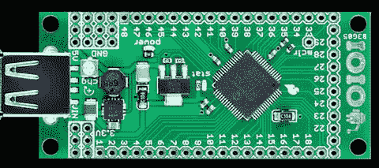

# Android 手机的分线板

> 原文：<https://hackaday.com/2011/04/07/a-breakout-board-for-your-android-phone/>

[sparkfun]本周宣布了一个名为 IOIO(发音为“溜溜球”)的[新板](http://www.sparkfun.com/products/10585) ，它允许你的 Android 设备与你即将到来的项目进行通信。

董事会还没有发布；[sparkfun]仍然在收集文档，等待他们的第一次生产运行。我们知道该板包含 PIC24F MCU，可为您的手机提供模拟输入、数字 I/O、PWM、I2C、SPI 和 UART 控制。与主板的通信通过手机上的 USB 端口进行。

这个板的优点是不需要外部程序员。你连接到这个板上的一切都可以从 Android 应用程序中控制。我们之前在一个黑客教程系列中介绍过 Android 开发[，所以现在有可能将这些技能应用到你的项目中，为你的项目提供触摸屏、互联网和蓝牙连接、摄像头或者你手机的加速度计。非常圆滑。](http://hackaday.com/2010/07/12/android-development-101-%E2%80%93-a-tutorial-series/)

一些基本功能的视频演示了跳转后该板可能实现的功能，但请随意评论并告诉我们您希望看到该板实现的功能。