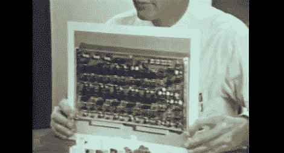

# 集成电路简介

> 原文：<https://hackaday.com/2011/02/04/a-briefing-on-integrated-circuits/>

尽管技术在不断地向更快/更小/更大的方向发展，但许多制造技术的基本原理仍然是相似的，如果不是相同的话。[这个有趣的 30 分钟视频剪辑](http://www.youtube.com/user/ComputerHistory#p/search/7/z47Gv2cdFtA)[感谢计算机历史博物馆]由飞兆半导体公司于 1967 年制作，作为集成电路的简报，展示了生产 IC 的不同步骤，包括:

设计、制作光掩模、制造硅锭、准备晶片、构建电路及其组件(如晶体管、电阻和电容)、测试和最终封装。添加一些其他有趣的酷项目，如 1960 年的 pick n place 机器、波峰焊、自动绕线机，并加入一些复古的计算机动作，这肯定是一个值得观看的视频，每个人都有一些东西。

所以休息之后加入我们，放松一下，享受表演吧！

[https://www.youtube.com/embed/z47Gv2cdFtA?version=3&rel=1&showsearch=0&showinfo=1&iv_load_policy=1&fs=1&hl=en-US&autohide=2&wmode=transparent](https://www.youtube.com/embed/z47Gv2cdFtA?version=3&rel=1&showsearch=0&showinfo=1&iv_load_policy=1&fs=1&hl=en-US&autohide=2&wmode=transparent)