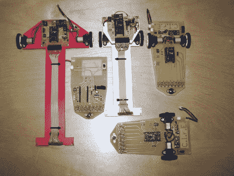

# 快速跟随者的集合

> 原文：<https://hackaday.com/2010/08/13/a-collection-of-quick-line-followers/>

这里有一组很好的循线机器人 ( [翻译](http://translate.google.com/translate?hl=en&sl=auto&tl=en&u=http://jmnlab.com/robotzero/rzvd9.html))。它们速度很快，即使在急转弯时也不会偏离轨道。他们以一个小猩猩板为中心，该板具有 ATmega328 微控制器和两个电机驱动通道。这些驱动齿轮电机，并使用光学传感器跟踪光表面上的暗线。如果你对血淋淋的细节感兴趣，有大量的[构建和测试信息](http://jmnlab.com/robotzero/robotzerov.html) ( [翻译](http://translate.google.com/translate?js=y&prev=_t&hl=en&ie=UTF-8&layout=1&eotf=1&u=http://jmnlab.com/robotzero/robotzerov.html&sl=auto&tl=en))。或者跳过休息时间，看看红色在做什么。

[https://www.youtube.com/embed/0b8c88wcK8M?version=3&rel=1&showsearch=0&showinfo=1&iv_load_policy=1&fs=1&hl=en-US&autohide=2&wmode=transparent](https://www.youtube.com/embed/0b8c88wcK8M?version=3&rel=1&showsearch=0&showinfo=1&iv_load_policy=1&fs=1&hl=en-US&autohide=2&wmode=transparent)

[谢谢吉姆]

[http://translate.google.com/translate?js=y&prev = _ t&HL = en&ie = UTF-8&layout = 1&eotf = 1&u = http://jmnlab . com/robot zero/robot zerov . html&sl = auto&TL = en](http://translate.google.com/translate?js=y&prev=_t&hl=en&ie=UTF-8&layout=1&eotf=1&u=http://jmnlab.com/robotzero/robotzerov.html&sl=auto&tl=en)