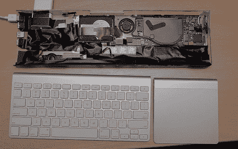

# 空气制成的桌面

> 原文：<https://hackaday.com/2010/08/17/a-desktop-made-of-air/>

[Bart]设法得到了一台免费的 Macbook Air。问题是显示器铰链坏了，笔记本电脑也不是太好。他决定将它改造成一台键盘电脑，而不是将其废弃或用作[切蛋糕机](http://www.engadget.com/2008/06/01/hp-exec-cuts-birthday-cake-with-macbook-air/)。通过拆除内部零件，他能够以最小的改动安装所有的部件。[Bart]增加了一些东西，使它成为一个功能性桌面，例如在键盘下集成了一个 USB 集线器，并为键盘配备了一个 Magic Trackpad。正如任何伟大的黑客一样，该项目仍在进行中，我们迫不及待地想看到它的最后润色。