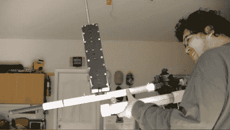

# 全自动 PVC 电池枪

> 原文：<https://hackaday.com/2012/03/18/a-full-auto-pvc-battery-gun/>

那么有什么比电池枪更好呢？一把[全自动气动电瓶枪](http://www.youtube.com/watch?v=A6Gs2mKNjV0&feature=youtu.be "full auto battery gun")当然！[ukillihear]决定建造一个，休息后在他的视频中向我们展示结果。打开枪后，这个装置以令人印象深刻的射速射击(虽然，显然没有他的其他实验快)。显然，电池可以对纸板靶造成相当大的损害，如图 1:20 所示。[ukilliheal]显然认为这很搞笑，但我们不想在这个设备的另一端！

虽然在这个视频中关于这个构建的细节相当少，但[ukilliheal]的其他视频应该会提供一些线索，特别是那些他解释如何制作全自动彩弹枪的视频。如果使用同样的技术，活塞通过自制的阀门重新加载燃烧室，当压力过高时释放压力。也可以使用电子设备，但保持一切机械将允许电池仅用作弹药。

[https://www.youtube.com/embed/A6Gs2mKNjV0?version=3&rel=1&showsearch=0&showinfo=1&iv_load_policy=1&fs=1&hl=en-US&autohide=2&wmode=transparent](https://www.youtube.com/embed/A6Gs2mKNjV0?version=3&rel=1&showsearch=0&showinfo=1&iv_load_policy=1&fs=1&hl=en-US&autohide=2&wmode=transparent)

如果你不喜欢全自动枪，为什么不试试这款[闩动式微型气动定位枪](http://hackaday.com/2011/04/09/bolt-action-pneumatic-spud-gun/ "bolt action pneumatic spud gun")！