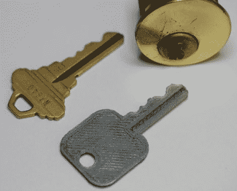

# 真实世界的钥匙

> 原文：<https://hackaday.com/2011/05/31/a-keygen-for-the-real-world/>

[Nirav]发现他很少用 RepRap 打印任何有用的东西，所以为了改变现状，他决定做一个不需要打印更多 RepRap 部件的项目。

他的项目的目标是通过简单地使用工厂印制的代码来制作房子钥匙的复制品。他从易贝购买了一把二手锁，然后用尺子和卡尺仔细测量钥匙，以获得恰到好处的空白尺寸。完成后，他在网上四处查看，最终能够使用他找到的引脚深度规格图表创建一个 OpenSCAD 模型。通过改变模型代码的最后一行，他可以打印任何编码的密钥。对于没有密码的钥匙，他可以手动测量每一位的高度，并以这种方式打印复制品。一旦打印出来，他说这些钥匙足够坚固，可以转动他遇到的大多数锁，包括死栓。

这无疑是一个很好的项目，尽管我们很想知道是否有人可以将它与像 [SNEAKEY](http://vision.ucsd.edu/~blaxton/sneakey.html) 这样的程序结合起来，仅通过视觉生成 bit 测量。