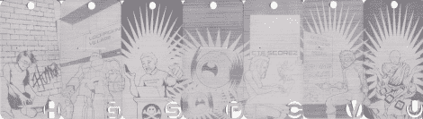

# 回顾 DefCon 18 徽章

> 原文：<https://hackaday.com/2011/01/07/a-look-back-at-defcon-18-badges/>

像每年一样，[Joe Grand]给了[一个解释 Defcon 18 徽章](https://www.defcon.org/html/links/dc-archives/dc-18-archive.html#Grand)开发过程的演讲。当[的细节在 7 月](http://hackaday.com/2010/07/31/defcon-18-official-badges/)开始慢慢流出时，我们就在关注这些。它们以 LCD 的形式展示了一点简洁的技术，就像 ePaper 一样。保持图像不需要任何电力，只需要改变显示。对于电池供电的设备来说，这是一个很有价值的功能，可以让他从 CR2032 中获得大约 9 天的电量。今年的徽章也使用激光蚀刻铝作为基板。

我们在休息后嵌入了谈话，发现它足够有趣，可以看完整个小时。如果你对徽章带来的黑客攻击更感兴趣，我们整理了[一份视频播放列表](http://www.youtube.com/view_play_list?p=AAAFC6D561C67655) [Joe]在会议期间拍摄的视频。

[乔·格兰德]在视频开始大约 9 分钟时

[https://www.youtube.com/embed/S5NnvpFVILc?version=3&rel=1&showsearch=0&showinfo=1&iv_load_policy=1&fs=1&hl=en-US&autohide=2&wmode=transparent](https://www.youtube.com/embed/S5NnvpFVILc?version=3&rel=1&showsearch=0&showinfo=1&iv_load_policy=1&fs=1&hl=en-US&autohide=2&wmode=transparent)

[via [危险原型](http://dangerousprototypes.com/2011/01/03/making-of-the-defcon-18-badge/)