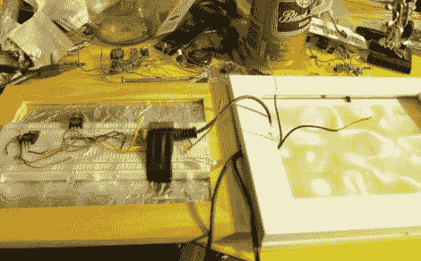

# 一个快速和肮脏的 VU 米为您的下一次聚会

> 原文：<https://hackaday.com/2011/08/21/a-quick-and-dirty-vu-meter-for-your-next-party/>

如果你想要一个简单的项目来为你的下一次聚会增添趣味，很可能你手头已经有零件来组装快速而肮脏的 VU 米灯。他设计的电路使用音频输入来触发 PNP 晶体管的基极，通过一串 led 来切换电源。他为每个立体声输出信号使用了四盏灯，让它们随着音乐跳动，就像在休息后的视频中看到的那样。该电路建立在试验板上，并安装在一个带有不太令人印象深刻的扩散器的相框中(我们认为这总是最难的部分……如果你想要真正工作良好的东西，请检查这个项目中使用的[重霜](http://hackaday.com/2011/02/09/daft-punk-module-just-add-table/))。

有一些 VU 米芯片将真正增强这一概念。但一个改进可能是加入一个放大器芯片，如 LM386 和几个电位计，以便您可以调整灵敏度。

[https://www.youtube.com/embed/jFnrBWQRTsY?version=3&rel=1&showsearch=0&showinfo=1&iv_load_policy=1&fs=1&hl=en-US&autohide=2&wmode=transparent](https://www.youtube.com/embed/jFnrBWQRTsY?version=3&rel=1&showsearch=0&showinfo=1&iv_load_policy=1&fs=1&hl=en-US&autohide=2&wmode=transparent)