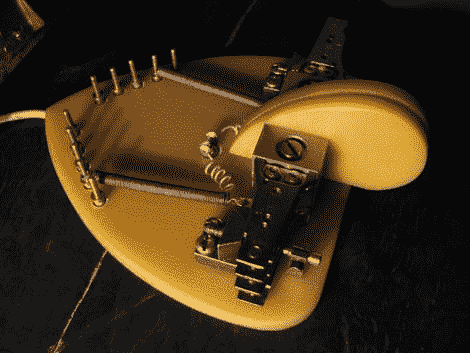

# 死硬盘的第二次生命

> 原文：<https://hackaday.com/2010/02/24/a-second-life-for-dead-hard-drives/>

[AndyUU1CC]整理了他如何用一些旧硬盘制作一个抑扬格拨片的说明。[抑扬格桨是一种电报设备](http://en.wikipedia.org/wiki/Telegraph_key)。更具体地说，就是你经常看到人们在发电报时用手指点击的那块。我们以前没有见过抑扬格或“双杠杆”风格，但我们现在知道这是一个不寻常的设计。虽然它最终只是一套奇特的开关，但我们不禁对它的外观印象深刻。

[通过[指令栏](http://www.instructables.com/id/Second-Life-Of-MFM-Hard-Drives-Iambic-Telegraph-/?ALLSTEPS/)