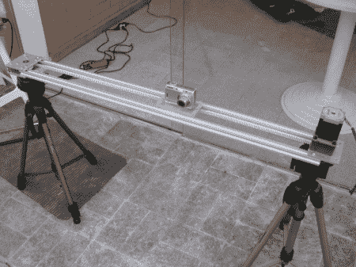

# 用于延时摄影的简易推车

> 原文：<https://hackaday.com/2011/07/03/a-simple-dolly-for-time-lapse-photography/>

[Henrique]来信告诉我们他的延时摄影技术。相机的触发是通过 [CHDK](http://chdk.wikia.com/wiki/CHDK) 或佳能黑客开发套件完成的。这个实验套件允许佳能 Powershot 相机运行脚本以及其他简洁的功能，而不会永久改变任何东西。在这里可以找到[这个黑客](http://chdk.wikia.com/wiki/UBASIC/Scripts)和其他人的用户脚本。

一旦相机被设置为在预定的时间内拍摄照片，LDR(光敏电阻)就被用来检测照片实际拍摄的时间。每当图像存储在相机中时，相机上的 LED 就会闪烁，因此这提供了一种简单的方式来感知何时发生这种情况。

一旦接收到这个信号，PIC 16f84 处理器和相关电路就使步进器每次步进一次。这个实验的结果非常令人印象深刻，所以休息后一定要查看结果。

[https://player.vimeo.com/video/25623454](https://player.vimeo.com/video/25623454)

另一个有趣的相机触发黑客，看看这个由空气清新剂制成的[触发机制](http://hackaday.com/2011/02/04/remote-camera-trigger-built-from-air-freshener-parts/)！