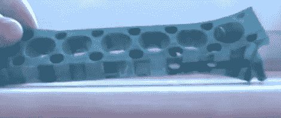

# 一种避免大型 3D 印刷品变形的技术

> 原文：<https://hackaday.com/2011/11/15/a-technique-to-avoid-warping-on-large-3d-prints/>

[Jamie Mantzel]找到了自己的 3D 打印大型物体的方法，而不用担心变形。首先是一些背景信息。当使用像 RepRap 或 Makerbot 这样的 3D 挤压打印机时，跨越大面积的打印往往会变形。这是因为这些打印机一次只能打印一层薄薄的塑料。如果第一层冷却过度，在铺设下一层之前，它会收缩一点。当第二层冷却时，它将零件拉向中心，最终使零件弯曲，使其撞击挤出机机头。

在几次印刷遇到这个问题后,[Jamie]决定改变他的设计，这样就不会产生这些压力。他做的第一件事是在木筏和实际部分之间的一层上添加交替的空隙。你可以看到上面图片底部的凹口。这考虑了第一层的初始应力。接下来，他在零件主体的任何地方添加孔。这一点对于翘曲力最大的部件边缘尤其重要。

他还将床的起始位置移近挤出机头。他希望这将有助于木筏更好地结合，并在打印过程中防止脱离底座。

休息后看他对自己冒险经历的视频解释。

[https://www.youtube.com/embed/YhfrHo53K18?version=3&rel=1&showsearch=0&showinfo=1&iv_load_policy=1&fs=1&hl=en-US&autohide=2&wmode=transparent](https://www.youtube.com/embed/YhfrHo53K18?version=3&rel=1&showsearch=0&showinfo=1&iv_load_policy=1&fs=1&hl=en-US&autohide=2&wmode=transparent)

[谢谢齐丹]