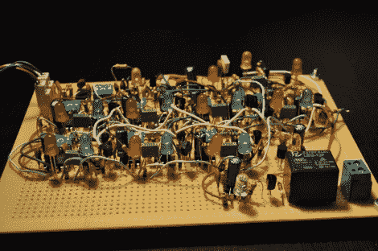

# 三个最后一刻的 555 定时器项目

> 原文：<https://hackaday.com/2011/02/28/a-trio-of-last-minute-555-timer-projects/>

[鲍勃]最近一直在忙着对他计划参加的 [555 设计大赛](http://hackaday.com/2011/01/25/555-design-contest-win-1500-in-prizes/)的[三个](http://www.electrobob.com/555-h-bridge/)[项目](http://www.electrobob.com/555-class-d-amplifier/)进行收尾工作。

他的第一款产品是低功率 H 桥，可用于驱动小型伺服系统。虽然他承认使用 555 定时器来构建 H 桥有点奇怪，但它们足够便宜和充足，值得使用。看看下面的视频，看看简单的 H 桥控制伺服。

[Bob]的第二个条目比他的 H 桥要复杂得多。他的秘密敲击探测器监听敲击的模式，如果探测到合适的节奏就触发继电器。如果听到敲门声，第一个 555 定时器启动，在特定的时间范围内监听另一个敲门声。如果在此期间听到敲门声，则触发下一个计时器，并重复该过程。随后的敲击必须被正确计时，否则电路停止，等待复位定时器期满后再继续监听。这是一个有点难得到正确的敲打，但应该可以修复一些小的调整。

他发给我们的第三个条目是一个非常普通的项目，尽管有一个不太常见的实现。D 类放大器通常作为低功耗耳机放大器，用于个人音频应用。他喜欢 D 类放大器的想法，但想建立一个有足够功率的东西，在一个小房间里听他的音乐。为了完成这项任务，他查看了 555 定时器的内部框图，并自己构建了一对高功率 555 定时器，使用分立元件来模仿 555 封装中常见的元件。他的结果还不错，虽然不可否认不是最高的质量，可以稍微调整一下以提供更好的声音保真度。

继续阅读，查看每个项目的视频。

[https://www.youtube.com/embed/EnnnFyLi88s?version=3&rel=1&showsearch=0&showinfo=1&iv_load_policy=1&fs=1&hl=en-US&autohide=2&wmode=transparent](https://www.youtube.com/embed/EnnnFyLi88s?version=3&rel=1&showsearch=0&showinfo=1&iv_load_policy=1&fs=1&hl=en-US&autohide=2&wmode=transparent)

[https://www.youtube.com/embed/wfnAwhaTEQs?version=3&rel=1&showsearch=0&showinfo=1&iv_load_policy=1&fs=1&hl=en-US&autohide=2&wmode=transparent](https://www.youtube.com/embed/wfnAwhaTEQs?version=3&rel=1&showsearch=0&showinfo=1&iv_load_policy=1&fs=1&hl=en-US&autohide=2&wmode=transparent) [https://www.youtube.com/embed/pkLJAFKBm5g?version=3&rel=1&showsearch=0&showinfo=1&iv_load_policy=1&fs=1&hl=en-US&autohide=2&wmode=transparent](https://www.youtube.com/embed/pkLJAFKBm5g?version=3&rel=1&showsearch=0&showinfo=1&iv_load_policy=1&fs=1&hl=en-US&autohide=2&wmode=transparent)