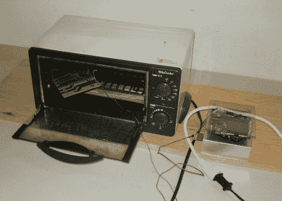

# 非常详细的回流焊炉构造

> 原文：<https://hackaday.com/2012/01/01/a-very-detailed-reflow-oven-build/>

如果你做了很多 SMD 焊接，[回流焊炉是最快和最有效的方法](http://www.instructables.com/id/Hack-a-Toaster-Oven-for-Reflow-Soldering/?ALLSTEPS)让所有这些微小的元件附着在你的 PCB 上。[Frank Zhao]看到了过去几周我们[在这里](http://hackaday.com/2011/11/15/solder-reflow-toaster-oven/)展示的[回流焊炉](http://hackaday.com/2011/11/24/toaster-oven-reflow-control-without-modifying-the-oven/)，并认为他也可以展示一下他的设备。我们当然很高兴他这样做了，因为他非常全面的书面记录是任何人寻求建造自己的回流炉的巨大垫脚石。

像许多其他人一样，他从一个用过的烤面包机开始，对它进行了改造，使其可以通过电源线直接控制，而不是通过烤箱的转盘。他建造了一个小型 PCB 来调节烤箱，其特点是 ATmega32u4 和热电偶来控制温度。加热元件的控制是通过一个固态继电器来完成的，为此他建造了自己的散热器。

他研究了他将使用的焊料的回流曲线，编程微控制器来调节加热/冷却过程，除了打开烤箱之外，不需要任何用户输入。

查看下面的视频，以了解他的系统的简要概述，并确保浏览他的文章，看看所有的构建细节。有一些额外的视频和大量的图片，贯穿了整个过程的每一步。

[https://www.youtube.com/embed/TYAl2s3tuMI?version=3&rel=1&showsearch=0&showinfo=1&iv_load_policy=1&fs=1&hl=en-US&autohide=2&wmode=transparent](https://www.youtube.com/embed/TYAl2s3tuMI?version=3&rel=1&showsearch=0&showinfo=1&iv_load_policy=1&fs=1&hl=en-US&autohide=2&wmode=transparent)