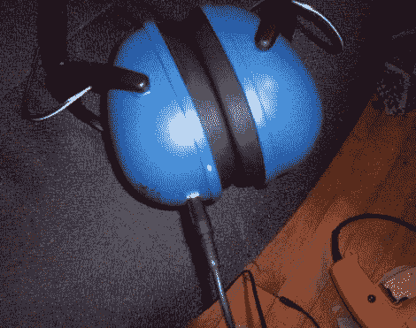

# [Aaron]向我们展示了如果[Bob Vila]开始黑耳机，生活会是什么样子

> 原文：<https://hackaday.com/2012/03/27/aaron-shows-us-what-life-would-be-like-if-bob-vila-started-hacking-headphones/>

[Aaron Horeth]有一副曾经风光过的耳机，在他扔掉它们之前，他意识到他可以用它们来制作一套定制的易拉罐。他一直想要一副带可拆卸线的耳机，以防止被绊倒时受损，他认为他的旧耳机是完美的捐赠品。

他逛了逛当地的五金店，仔细阅读了他们收集的建筑耳罩，最终找到了一套看起来不错，而且不贵的耳罩。使用建筑耳罩作为耳机的框架，给他带来了他一直在寻找的耐用性，以及旨在隔绝外来噪音的额外好处。一旦他把它们带回家，他就从他的旧耳机中取出驱动器，把它们安装到耳罩中，但在此之前，他把它们连接起来，以支持一根断开的输入电缆。

毫无疑问，修改是简单的，但我们想象它们在修理车间时会非常方便。