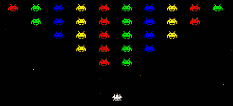

# 基于加速度计的游戏控制，使用 HTML5 提供的 IOS 设备

> 原文：<https://hackaday.com/2012/03/26/accelerometer-based-game-control-using-an-ios-device-courtesy-of-html5/>

这个太空入侵者的游戏是通过向左或向右倾斜你的 iPhone 来玩的。这是一个 HTML5 的演示，用来链接浏览器中的设备。唯一需要的设置是让基本设备加载一个网页，然后控制设备扫描一个二维码(或只需输入一个链接)来连接游戏。如果你愿意，你现在就可以[试一试](http://www.webdigi.co.uk/fun/space/)。

它只适用于 iOS 设备，但我们认为这是因为移动 Safari 有能力轮询加速度计数据，而其他浏览器没有。如果这是使用屏幕按钮而不是倾斜控制，它将在任何实现 HTML5 的设备上工作。Node.js 和 Socket.IO 有助于连接。主机页面生成的 QR 码包含一个唯一的 ID，允许控制设备与其链接。加载后，来自控制器的命令通过套接字发送。主机上节点的 IO。

与[这种基于 HTML5 的传感器数据应用](http://hackaday.com/2011/10/25/wicked-use-of-html5-to-display-sensor-data/)一样，我们认为这种方法很重要，因为它允许在不需要独立应用的情况下进行控制。我们希望在未来的嵌入式项目中看到很多这样的东西。通过向智能手机或其他设备提供数据，您的项目就不再需要物理用户界面，这意味着您可以花更少的钱做出更好的东西。

[via [Reddit](http://www.reddit.com/r/programming/comments/ra9j4/use_your_iphone_as_a_controller_for_an_html5_game)