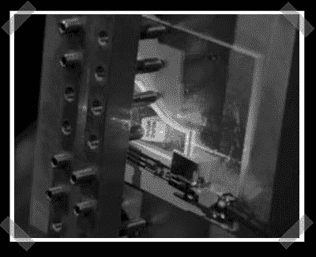

# 声学产生的全息图

> 原文：<https://hackaday.com/2007/07/08/acoustically-generated-holograms/>

我在【hackedgadgets】上找到了[这个](http://hackedgadgets.com/2007/07/04/holographic-video/)，并查看了[描述该项目的论文](http://www.media.mit.edu/%7Evmb/papers/6488-19.pdf)。我不确定它是否会很快生成任何真正可用的图形，但这项技术非常有趣。它结合了六个视频频道，并使用音频和微小但外观简单的传感器来振动晶体，从而引导激光生成全息图。(如果我没看错的话)令人惊讶的是，一个 nvidia 芯片就能为系统生成所有六个通道。令人恼火的是，MITs 网站上缺乏信息，但是在这篇文章的多媒体链接下有一组漂亮的图片。