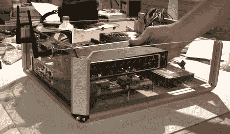

# 亚克力雕花外壳

> 原文：<https://hackaday.com/2010/06/29/acrylic-hackintosh-housing/>

[鲁伊·加托]需要一台强大而便携的机器来进行表演。如果是在舞台上不也应该好看吗？我们喜欢看他为他的装置建造一个丙烯酸外壳。他熟练地使用旋转工具，光是他放入机箱风扇格栅的工作就令人印象深刻。休息后的视频。

[https://player.vimeo.com/video/3138517](https://player.vimeo.com/video/3138517)