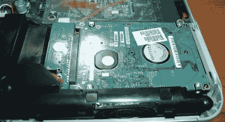

# 为您的笔记本电脑添加第二个内置硬盘

> 原文：<https://hackaday.com/2008/06/23/add-a-second-internal-hard-drive-to-your-laptop/>

【Andrew】送来了我们一直在考虑的 17 英寸戴尔产品。他把一个 100GB 的 PATA 笔记本硬盘塞进了康柏笔记本电脑的备用空间。他使用 USB 接口来提供连接，并添加了一个拨动开关，以便在不需要驱动旋转时节省电能。如果你增加一个键盘激活开关，比如[【sprite _ TM】的键盘灯](http://www.hackaday.com/2006/10/30/thinkpad-style-keyboard-light/)，这个 mod 会更好。

*   [永久链接](http://www.fewt.com/2008/06/laptop-hacking-just-little-more-space.html)