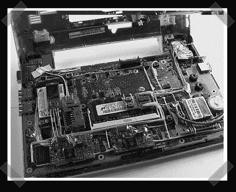

# 将所有内容添加到您的 EeePC

> 原文：<https://hackaday.com/2008/01/19/add-everything-to-your-eeepc/>

【c . k】[传递了这篇](http://beta.ivancover.com/wiki/index.php/Eee_PC_Internal_Upgrades)令人印象深刻的关于修改 eeePC 的文章，几乎囊括了你能想到的所有内容。这个有两个四端口 USB 集线器，内置 GPS，蓝牙，56k 调制解调器，FM 音频发射器，4gb USB 闪存驱动器和一个 801.11a/b/g/n 卡，带有一个备用天线，完全支持 802.11n。布线工作看起来很棒——非常干净，做得很好。唯一缺少的是触摸屏。

*   [永久链接](http://beta.ivancover.com/wiki/index.php/Eee_PC_Internal_Upgrades)