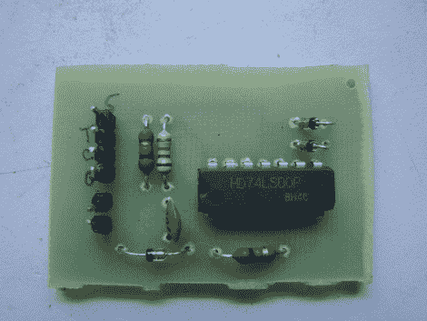

# 为 Atari 2600 添加暂停按钮

> 原文：<https://hackaday.com/2010/02/23/add-pause-button-to-the-atari-2600/>

我们确信，如果 Atari 2600 上有一个暂停按钮，人们永远不会转向下一代系统。现在你可以从壁橱里翻出游戏遗物，暂停你的雅达利游戏，转而玩一些老式的 T2 游戏。这个黑客来自成功制作[雅达利 2600 点唱机](http://hackaday.com/2009/12/16/2600-game-jukebox/)的同一个人。通过对 [Onyx Jr.](http://ultimateconsoledatabase.com/others/onyxjr.htm) 上使用的信号进行逆向工程，暂停方法变得清晰起来。

问题是 Onyx Jr .使用了与 2600 不同的处理器。不同的处理器意味着不同的引脚排列，现在同步暂停周期所需的时钟信号丢失了。但是找到了一个抽象的来源。来自另一个芯片的就绪信号可以用来判断处理器的状态。上面的小 PCB 现在与 Atari 2600 接口，以便插入暂停电路。

[再次感谢雅皮士，让他们来吧！]