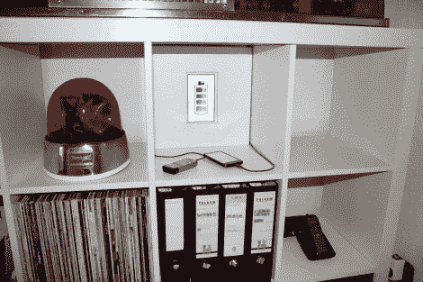

# 给你的手机充电设置添加一点润色

> 原文：<https://hackaday.com/2011/09/14/adding-a-little-polish-to-your-cellphone-charging-setup/>

电缆管理真的很碍眼，但是一点创造性的伪装，你可以有一个手机充电站，也可以作为装饰。

[Kitesurfer]想用他新买的宜家书架上的一个小格子充电，但对随之而来的老鼠窝电线不感兴趣。他也不想接受无线充电的挑战，于是他来到这家家居巨头的原样区，抓起一块与橱柜表面相同的剩余木板。它现在是充电中心的伪背板，后面隐藏着电源板和壁瘤。

这掩盖了问题，但一个装满充电线商业端的空白白盒并不是一个更好的整体。就像魔术表演一样，诀窍在于重定向。[风筝冲浪]在假封底上剪了一个洞，并添加了数码相框的内脏。现在他让它在不同的充电图标间滚动，但如果他厌倦了，很容易改变幻灯片。我们很想看到后续的破解，让相框通过蓝牙访问你手机上的照片。