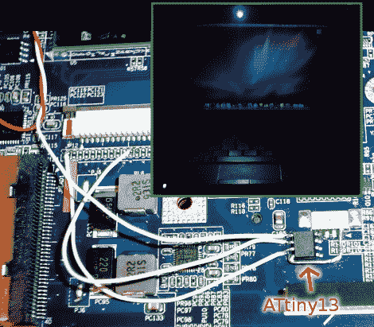

# 添加上网本键盘灯

> 原文：<https://hackaday.com/2010/01/28/adding-a-netbook-keyboard-light/>

[Vikash]在黑暗中使用他的上网本有困难，所以他[增加了一个键盘灯](http://www.mydellmini.com/forum/dell-mini-9-hardware-upgrades/17821-keyboard-illumination-led-modification-pics.html)。他有一台 Dell Vostro 成就 A90，其硬件与广受欢迎的戴尔 Mini 9 相同。我们同意精简的键盘布局使得不看键盘很难打字；只要试着找到引号、括号和波浪号键就行了！他在液晶显示屏周围的边框上添加了一个 LED，以便照亮周围的情况。现在可以使用 CTRL 键打开 LED。ATtiny13 微控制器监控键盘的引脚 1 和 11，等待 CTRL 键的按下，然后在接收到它时打开灯。这种硬件解决方案意味着，无论你运行的是 [Hackintosh](http://hackaday.com/2009/06/16/dell-vostro-a90-hackintosh/) (就像他一样)、Ubuntu(就像我们一样)，还是其他操作系统，都无关紧要。