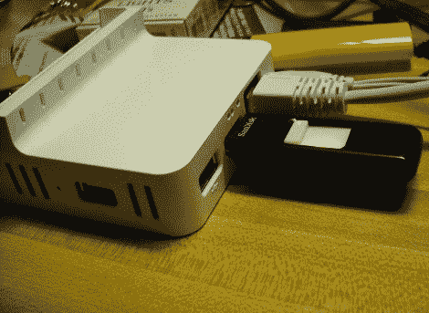

# 向 Dockstar 添加串行端口

> 原文：<https://hackaday.com/2010/07/22/adding-a-serial-port-to-a-dockstar/>

如果你不仔细看，你可能会认为这个希捷码头之星是在股票的条件。但是看看拇指驱动器上方的白色外壳中的三个孔，它们充当 Dockstar 的串行连接。[Firestorm_v1]在看到我们关于[在设备](http://hackaday.com/2010/07/17/openwrt-on-a-seagate-freeagent-dockstar/)上安装 OpenWRT 的帖子后贴出了说明。他做了一个很好的隐藏连接的工作，加热一个引脚头来融化他需要的孔。现在，他可以在不牺牲功能或美观的情况下快速访问。串行转 USB 电缆采用极化引脚接头，以确保快速准确的连接。这对于 PC 连接来说是很棒的，但是你也永远不知道你什么时候想要[给网络设备添加你自己的硬件位](http://hackaday.com/2009/09/29/add-ir-control-to-your-wifi-router/)。