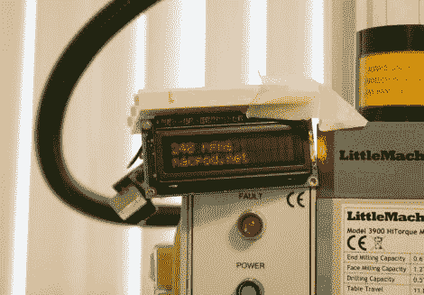

# 为 SX2 小型研磨机添加转速表

> 原文：<https://hackaday.com/2011/05/12/adding-a-tachometer-to-the-sx2-mini-mill/>

[Jeff]最近购买了一台 SX2 迷你铣床，计划最终将其自动化，用作数控铣床。在支付了近 700 美元购买磨机后，他决定没有办法再支付 125 美元的转速表附加费用。相反，[他对磨坊进行了逆向工程，建造了自己的转速计](http://macpod.net/misc/sx2_tachometer/sx2_tachometer.php)。

他打开控制箱，开始四处张望。在确定了大部分组件后，他被一个似乎没有任何特殊功能的 3 针接头岔开了。也就是说，直到他意识到同一制造商的车床使用相同的组件，并认为割台可能用于反转电机。果然他是对的，加了一个反向开关后，又回到了正题。

他用逻辑分析仪探测了一下 7 针插座，很快就找到了工厂的数据线。他把线接到 Arduino 上，很快每分钟转数就显示在液晶显示屏上。

[Jeff]说这个小实验是许多实验中的第一个，因为工厂对黑客非常友好。我们绝对期待在不久的将来看到一个数控转换教程。