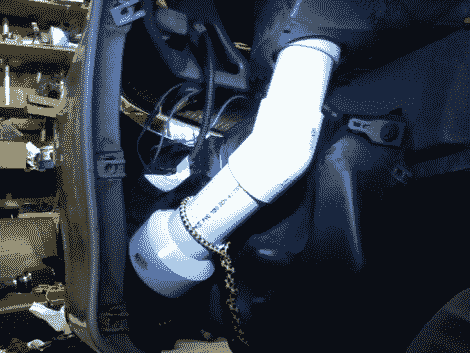

# 添加汽车冷空气进气口

> 原文：<https://hackaday.com/2010/03/16/adding-an-automotive-cold-air-intake/>

[托马斯]和一个朋友正在喝啤酒，他们决定[改装他们的 2001 年雪佛兰骑士以获得更好的性能](http://s181.photobucket.com/albums/x136/ymmotfour/Cold%20air%20intake%20hack/)。如果他们能找到一种方法来给引擎带来更冷的空气，他们推测他们会看到效率的提高。他们没有将进气口接到引擎盖上，而是取下了工厂的空气过滤器，在它的位置上安装了一个冷空气过滤器。然后使用 PVC 管从车辆前部建立一条输送路径，其输出非常接近新的过滤器。他们测试了他们的工作，发现进气温度在 60 英里/小时时从 101 华氏度下降到 48 华氏度，在 45 英里/小时时从 109 华氏度下降到 54 华氏度。现在，这款轿车跑得更好，马力更大，零件价格大约为 35 美元。