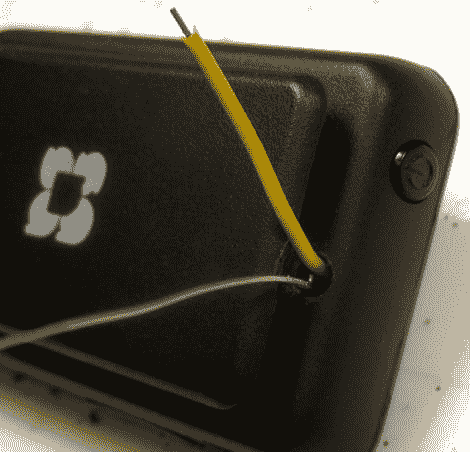

# 向 Sansa Clip+添加外部音频输入

> 原文：<https://hackaday.com/2011/09/20/adding-an-external-audio-input-to-the-sansa-clip/>

Workshop 88 成员[Jim]从 Woot 那里得到了几个 SanDisk Sansa Clip+ MP3 录音机/播放器，他迫不及待地想看看能用它们做些什么。

第一项任务是安装 RockBox，这是一个为各种 MP3 播放器构建的开源硬件包。固件的强大给他留下了深刻印象，尽管他认为珊莎的内置麦克风需要升级一下。根据一位广场舞爱好者的建议，他拆开了一个，看看如何添加外部音频输入。

他把现有的麦克风拆开，从主板上拆下来，在它的位置上安装了一个小电容和电阻。他将一些电线穿过箱子，然后给设备通电，以确保它仍然活着，并且状态良好。由于一切看起来都还不错，[吉姆]在珊莎的新输入设备上放了一些音频，果然它顺利地录制了音频。

他说，他最初对电容和电阻值的猜测相当不错，尽管稍加调整，他应该能够准确地得到他所寻找的记录水平。对于一个 20 美元的录音机来说还不错！