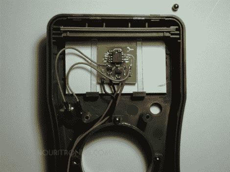

# 为廉价万用表添加自动关闭功能

> 原文：<https://hackaday.com/2011/07/29/adding-auto-off-to-a-cheap-multimeter/>

【弗罗林】为了一次做多次测量，拿起了一个便宜的万用表。不幸的是，他不太擅长在结束后记得关掉它，所以他烧坏了一些电池。为什么自动关机功能不是第一个被编码到固件中的东西，我们永远不会知道，但[Florin]开发了他自己的基于硬件的自动关机电路。

听起来他手头已经有了所有必要的组件。他拿了一个表面贴装封装的 AVR ATtiny25。为了保持电路板小，他没有包括 ISP 头，而是制作了长垫，可以焊接电线来更新固件。微控制器驱动一个 NPN 晶体管，该晶体管可以切断万用表与其电池之间的接地路径。一个触摸开关连接到一个外部中断引脚，当按下时，给你 15 分钟的时间来使用仪表。之后，芯片切断电源，进入睡眠模式。简单，足够小，可以放在箱子里。

[via [危险原型](http://dangerousprototypes.com/2011/07/28/add-auto-turn-off-to-a-cheap-multimeter/)