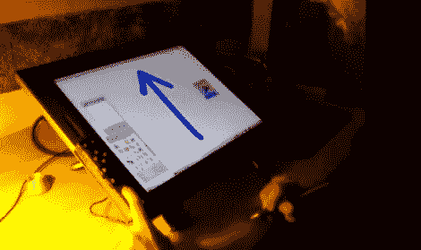

# 向 Cintiq 绘图板添加额外的按钮

> 原文：<https://hackaday.com/2011/07/14/adding-extra-buttons-to-a-cintiq-drawing-pad/>

[David Revoy]最近买了一台全新的 Cintiq 21UX，虽然他总体上喜欢绘图板，但他对平板电脑的按钮印象不太好。他说，大多数 2D 的 linux 应用程序需要很好的键盘交互，内置按钮不能满足要求。

在看到一位艺术家同事使用游戏手柄来增强他的平板电脑后，[David]认为他也可以做类似的事情，但他想添加更多的按钮。他找出了一个积满灰尘的旧罗技游戏垫，并将其拆开，在这个过程中重新排列了一些按钮。一旦他对布局感到满意，他就为 PCB 制作了一个纸板外壳，并通过 USB 将其连接到 Wacom。

他花了几分钟时间用 Qjoypad 将按钮映射到按键上，然后很快又增加了 14 个按钮。他说，这些额外的按钮让他的工作轻松了很多，也为他漫长的绘画过程增添了一点舒适。我们喜欢这样一个事实，那就是这不是一个永久的设备，而且他能够在这个过程中重新利用一个旧的游戏手柄。

查看下面的视频，快速演示他的绘图板黑客。

[via [Adafruit 博客](http://www.adafruit.com/blog/2011/07/14/gamepad-hack-for-more-button-on-cintiq21ux/)

[https://www.youtube.com/embed/DUBN23rNdWI?version=3&rel=1&showsearch=0&showinfo=1&iv_load_policy=1&fs=1&hl=en-US&autohide=2&wmode=transparent](https://www.youtube.com/embed/DUBN23rNdWI?version=3&rel=1&showsearch=0&showinfo=1&iv_load_policy=1&fs=1&hl=en-US&autohide=2&wmode=transparent)