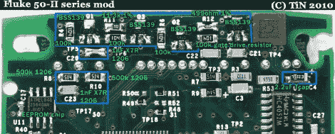

# 将 Fluke 54 II 特性添加到 51 II 温度计中

> 原文：<https://hackaday.com/2011/09/10/adding-fluke-54-ii-features-to-a-51-ii-thermometer/>

福禄克的 54 II 和 51 II 温度计之间的区别是增加了第二个双温度传感通道和控制数据记录的按钮。哦，高一点的型号再加 150 美元。[TiN]在内部四处打探，在一些论坛成员的帮助下，他想出了如何解锁他的低端 Fluke 温度计的附加功能。如果你不介意打开仪表，采购和焊接上面看到的大多数组件，在外壳上切割按钮孔，并希望当你把所有东西放回一起时它仍然工作，你也可以做同样的事情。

似乎 Fluke 设计了一个功能齐全的单元，并对其进行了稀释，以填补低价市场的漏洞，就像其他一些测试硬件制造商一样(想到了 [Rigol 的数字存储示波器](http://hackaday.com/2010/03/31/update-50mhz-to-100mhz-scope-conversion/))。但是该仪表中的 MSP430 P337I 不能刷新，因此如果两个型号的固件不同，这很可能是不可修复的硬件。在对 PCB 布局进行深入研究后，[TiN]发现一组电阻似乎没有外部硬件用途。它们连接到微控制器，共同产生一个两位代码。他能够获得四种不同硬件型号的图片，并找出哪些电阻组合可以识别不同的电表。现在，他可以让固件相信它正在运行一个 Fluke 54 II，其余的只是将正确的无源组件放到无人居住的位置。

我们认为这个任务是这个黑客的兴趣所在。[TiN]在拍摄和记录过程中的每一步方面做得非常出色。我们不太可能亲自尝试，但喜欢阅读相关内容。