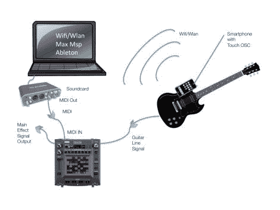

# 向 Kaoss Pad 添加远程触摸控制

> 原文：<https://hackaday.com/2011/05/02/adding-remote-touch-control-to-the-kaoss-pad/>

[Munki]喜欢在弹吉他时使用他的 Kaoss Pad MIDI 控制器为他的音乐添加新的维度。Kaoss Pad 界面唯一让他感到困扰的是，在一段糟糕的吉他独奏中很难触发或改变效果。他开始四处寻找，看看是否有办法通过触摸屏无线控制 Kaoss Pad[，并发现只要稍加调整，他的 iPhone 就是这项工作的完美候选人](http://www.progressivefactory.com/projects/kaossguitar/)。

他从 AppStore 中抓取了一份 TouchOSC，并将其配置为与他的电脑进行通信。在为他的 iPhone 建立了一个界面后，他把它粘在了他的吉他上，并尝试了一下。一切似乎都运行得很好，但他并没有就此止步——他还想从 iPhone 上控制 Ableton Live 和 Max MSP。这需要一点研究和一些现场 API 的修补，但他最终让一切都很好地一起工作，正如你在下面的视频中看到的。

如果您有兴趣亲自尝试一下，他的文章中有几个有用的链接，他还提供了 TouchOSC/Max MSP 补丁供下载。

【维梅奥 http://vimeo.com/23049259 w = 470】