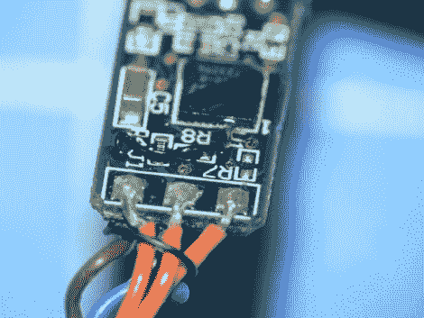

# 向 FTDI 电缆添加复位

> 原文：<https://hackaday.com/2010/04/30/adding-reset-to-an-ftdi-cable/>

黑客校友[亚当·哈里斯](http://hackaday.com/author/adamharris/)[黑了一根 FTDI 电缆](http://sheekgeek.org/2010/adamsheekgeek/add-automatic-reset-to-your-ftdi-232r-cable)用来给他的 Arduino 编程。打开塑料外壳后，他发现所用的 FTDI 芯片与[spark fun 编程器](http://www.sparkfun.com/commerce/product_info.php?products_id=8772)中的芯片相同。唯一真正的区别是，他的电缆没有重置 Arduino，他必须手动完成。解决方案是重新路由 RTS 线，使其连接到 DTR 引脚。这被证明是困难的，因为芯片的占地面积很小，但经过多次尝试，他成功地将一片金属线焊接到位。