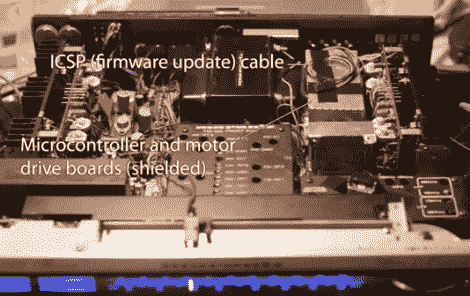

# 给老式立体声设备添加无线控制

> 原文：<https://hackaday.com/2011/08/19/adding-wireless-controls-to-vintage-stereo-equipment/>

[Jean]正在购买老式立体声接收器，偶然发现了一个坏的，但可修复的 Marantz 4240。在让事情恢复正常后，他认为如果他能[用他的 iPhone 远程控制单元](http://forums.audioholics.com/forums/showthread.php?s=a9d3c9c24afc2d3a53ba250223e8534d&t=75294&page=2) ( [PDF 文字整理](https://docs.google.com/uc?id=0B_Fd3w67AyoKZTYzOTJjMGYtZDFhYy00YmUyLTg4MDgtY2Q1OTJhZTU3MmE2&export=download&hl=en_US)、[原理图和代码](https://docs.google.com/viewer?a=v&pid=explorer&chrome=true&srcid=0B_Fd3w67AyoKN2E5YmYyMTktY2MxYi00YzY3LTg4MmQtZDFhZTVhNGQyZGE2&hl=en_US))就太好了。

他四处寻找零件，在找到一张照片和一些旧复印机和打印机的零件后，他开始工作。他蚀刻了一些定制板来放置电子元件，然后将马达绑在音量和信号源选择旋钮上。他还在接收器上安装了按钮电源开关，使用了一个小伺服系统和一点细绳。

现在，他可以使用 iPhone 控制一切，iPhone 通过 WiFi 与立体声系统通信。虽然电源、音量旋钮和输入选择器可以远程触发，但如果需要，他仍然可以手动调整这些项目。

我们认为这是给老式电子产品添加现代设施的好方法，而不会破坏组件的美观。不过不要相信我们的话，看看视频演示[Jean]但是一起跳完之后。

[https://www.youtube.com/embed/P-VqL7AyXtU?version=3&rel=1&showsearch=0&showinfo=1&iv_load_policy=1&fs=1&hl=en-US&autohide=2&wmode=transparent](https://www.youtube.com/embed/P-VqL7AyXtU?version=3&rel=1&showsearch=0&showinfo=1&iv_load_policy=1&fs=1&hl=en-US&autohide=2&wmode=transparent)

[https://www.youtube.com/embed/CR0XgLstFlo?version=3&rel=1&showsearch=0&showinfo=1&iv_load_policy=1&fs=1&hl=en-US&autohide=2&wmode=transparent](https://www.youtube.com/embed/CR0XgLstFlo?version=3&rel=1&showsearch=0&showinfo=1&iv_load_policy=1&fs=1&hl=en-US&autohide=2&wmode=transparent)