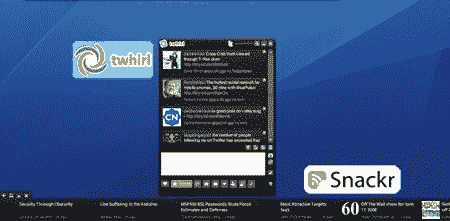

# Adobe Air 最值得安装的应用程序

> 原文：<https://hackaday.com/2008/06/18/adobe-airs-most-install-worthy-apps/>

Lifehacker 列出了[十大值得你花费时间和精力安装 AIR 的应用](http://lifehacker.com/396393/top-10-apps-worth-installing-adobe-air-for)。其中包括社交网络小工具、RSS 阅读器和其他实用工具。如你所知， [AIR 是一套跨平台的运行时](http://get.adobe.com/air/)，允许开发者创建在各种不同操作系统上运行的富互联网应用。运行时环境的安装和其他环境一样简单(例如 JRE)。

Snackr 和 [Twhirl](http://www.twhirl.org/) ，都是 Hack a Day 总部追踪新闻的主要人物。我们也听说了谷歌分析报告套件的好处，它对跟踪网站流量非常有用。尽管如此，我们倾向于认为我们的读者可以写出至少同样有创造性或有用的软件。如果你认为你可以胜任的话，[下载 Adobe AIR SDK](http://www.adobe.com/products/air/tools/sdk/) 并开始破解。

*   [永久链接](http://lifehacker.com/396393/top-10-apps-worth-installing-adobe-air-for)