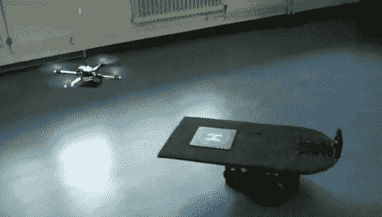

# 航空母舰是自主四轴飞行器的移动目标

> 原文：<https://hackaday.com/2010/05/25/aircraft-carrier-is-moving-target-for-autonomous-quadcopter/>

[卡尔-恩格尔伯特·文泽尔]开发了一种能够在移动平台上自主起飞和降落的无人机。该平台通过绕着房间转圈来操作航空母舰风格。四轴飞行器通过使用 Wii 遥控器上的红外摄像头来跟踪着陆甲板前部的红外 led 网格。最棒的是，飞行控制和处理都是由直升机的机载 ATmega644 处理器完成的，不需要连接到 PC。着陆非常精确，最大误差小于 40 厘米。在休息后的视频中，你可以看到第一次着陆有点偏离目标，但接下来的两次都准确无误。

因此，为自己打造一个移动平台，并与你新完成的四轴飞行器配对，复制这一令人愉快的技术。

[https://www.youtube.com/embed/XpUdW_U2KJ8?version=3&rel=1&showsearch=0&showinfo=1&iv_load_policy=1&fs=1&hl=en-US&autohide=2&wmode=transparent](https://www.youtube.com/embed/XpUdW_U2KJ8?version=3&rel=1&showsearch=0&showinfo=1&iv_load_policy=1&fs=1&hl=en-US&autohide=2&wmode=transparent)