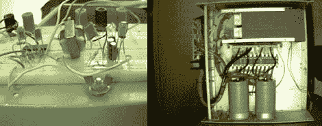

# 关于甚低频无线电的一切

> 原文：<https://hackaday.com/2010/04/14/all-about-vlf-radio/>

如果你有兴趣了解甚低频通信[，看看拉里在他的网站上提供了什么](http://www.home.pon.net/785/)。他为[编写了一份甚低频接收机指南](http://www.home.pon.net/785/equipment/build_your_own.htm)，这份指南足够简短易读，足够清晰易懂，只需具备基本的电路知识。他为[制造了一个简单的接收器](http://www.home.pon.net/785/equipment/homemade_b-field_receiver.htm)作为工作示例，并为[制造了一个可以输出超过 2600 瓦的高功率发射器](http://www.home.pon.net/785/equipment/transmitting/hptrans.html)。让我们面对现实吧，无线电操作员是最初的电子黑客。追根溯源，学习晶体管的工作方式。

[谢谢伙计]