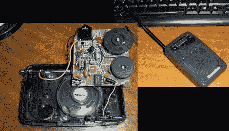

# 全波段接收器隐藏在显眼的地方

> 原文：<https://hackaday.com/2011/02/27/all-band-receiver-hides-in-plain-sight/>

这个手持收音机有个小秘密。你将无法听到林堡，因为原来的调频调谐电路已被删除，并由一个二极管检波器取代。现在[米格尔·a·瓦列霍]用一种谨慎的方式在公共场合寻找有趣的无线电信号。

他采取的第一步是从机箱中取出电路板，减少调谐电路，而留下音频放大器硬件。接下来，他参考了[一个经过验证的设计](http://www.techlib.com/electronics/allband.htm)，并在一块原型板上构建了二极管检测器电路。最后，他把新电路接到原来的音频放大器上(见上图)，然后把所有东西都放回盒子里。现在，他可以监听来自计算机键盘上的按键、射频数据通信和大量其他噪声源的数据突发。

这对于追踪搞砸你的项目的电噪声非常方便。

[感谢 Superlopez]