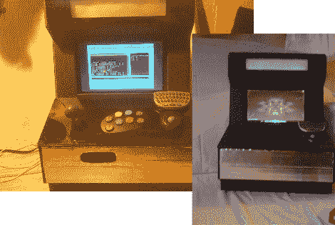

# 所有需要的是一个复古的油漆工作，极小

> 原文：<https://hackaday.com/2010/07/22/all-thats-needed-is-a-retro-paintjob-minimame/>

[【Tim】mini meme](http://www.timthegeek.net/projects/miniMAME/index.html)的建造遵循“轻而便宜”的方法，使用泡沫芯板和热胶。当然，它不能承受核攻击，但至少它足够轻，可以带到朋友家。

以可移动上网本为核心，CCFLs，扬声器，轨迹球和迷你街机格斗棍，[这个项目](http://www.timthegeek.net/miniMAME/miniMAMEConstruction.html)完全超出了我们的预期。对于那些希望[建造一个迷你](http://www.timthegeek.net/miniMAME/miniMAMEConstruction.html)的人来说，【蒂姆】包括大量的图片、细节和计划，允许任何人在大约一个下午的时间里制作自己的。