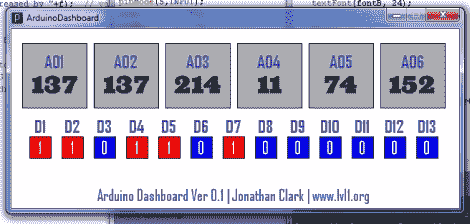

# 你所有的输入输出引脚都属于 ArduinoDashboard

> 原文：<https://hackaday.com/2011/08/24/all-your-io-pins-belong-to-arduinodashboard/>

因此，如果你深陷在一个基于 Arduino 的项目中，并且想要不断地监控所有的微处理器管脚，那么最好的方法是什么呢？来自路易斯维尔 LVL1 的[Jonathan Clark]想要更密切地关注他的板，并开发了一个他称之为 ArduinoDashboard 的应用程序。

该应用程序在处理过程中编程，使您可以在一个简单易用的显示器上查看 Arduino 板的所有模拟和数字引脚。运行这个应用程序所需要的只是在你的草图顶部插入一些代码，你可以在程序循环的任何地方调用这些代码。一旦被截取的代码被调用，所有电路板的引脚被读取，数据被发送到你的电脑。

ArduinoDashboard 目前仍处于测试阶段，但它看起来足够稳定，可以满足日常使用。[Jonathan]考虑了大量的改进和新功能，所以请务必经常回来查看有什么变化。

[via [Adafruit 博客](http://www.adafruit.com/blog/2011/08/22/arduino-dashboard-app/)