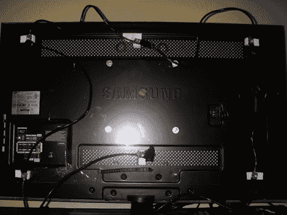

# 从 Arduino 和 ShiftBrite 模块构建的流光溢彩克隆

> 原文：<https://hackaday.com/2011/09/28/ambilight-clone-built-from-arduino-and-shiftbrite-modules/>

[Don]花大约 40 美元加上一台 Arduino 的费用，编写一份指南，帮助你[制作你自己的流光溢彩复制品。他将它与上面看到的 HTPC 一起使用，并在构建它时利用模块化概念，以便当您想要使用它进行原型制作时，可以轻松地断开 Arduino 板。](http://dhowdy.blogspot.com/2011/09/diy-arduino-ambilight-using-shiftbrites.html)

对于 RGB 光源[Don]获得了六个 ShiftBrite 模块。这些是完全可寻址的级联模块，使得硬件设置非常简单。他没有购买驱动屏蔽，而是使用 LM317、散热器和壁式电源来构建自己的驱动屏蔽，以提供足够的电流来驱动所有模块。

我们真的很喜欢使用的安装方案。每个模块都连接到一块丙烯酸树脂上，然后使用显示器背面的标准螺纹 VESA 安装孔进行安装。与其他流光溢彩的克隆版本一样,这款使用 Boblight 包在视频播放时获取颜色信息。