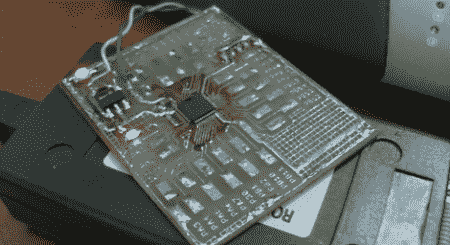

# 您可以在家里制作的 ARM 开发板

> 原文：<https://hackaday.com/2011/08/03/an-arm-dev-board-you-can-make-at-home/>

 

[BarsMonster]刚刚挑战了我们对 ARM 开发的概念，他的单面[开发板](http://www.youtube.com/watch?v=6JhCtATFVEU)装载了一个 [STM32F100](http://www.st.com/internet/com/TECHNICAL_RESOURCES/TECHNICAL_LITERATURE/DATASHEET/CD00212417.pdf) (PDF 警告)ARM 微控制器。该板非常简单，只需一个调节器、一个电阻和几个电容就能让一个 1 美元的 ARM μC 启动并运行。

[巴斯蒙斯特]给了我们一张他的冲浪板和[鹰的示意图。他的构建的 brd 文件](http://hosted.hackaday.com/stm.brd)。所有东西都是 SMD 元件，所以除了 9 个通孔，这个板可以在家里很容易地[制造。](http://hackaday.com/2008/07/28/how-to-etch-a-single-sided-pcb/)

虽然我们已经在 Hack A Day 看到了一些单边项目，但是用这种技术制作的 T2 开发板已经半途而废了。这让我们感到惊讶，因为单面电路板很容易用我们见过的[各种](http://hackaday.com/2011/05/21/pcb-milling-with-a-makerbot/) [数控](http://hackaday.com/2011/04/22/pcb-milling-tutorial/) [轧机](http://hackaday.com/2010/06/21/100-cnc-mill/)制造。

STM32 处理器有几个很棒的项目，比如 [web radio](http://www.youtube.com/watch?v=BfxxY2OY6TQ) ，但是【BarsMonster】在为他的 MCU 寻找一些好的库方面有些困难(特别是 Eagle 的 STM32 库)。如果你知道他能做什么，请在评论中或在他的[网站](http://3.14.by/en/)上留言。